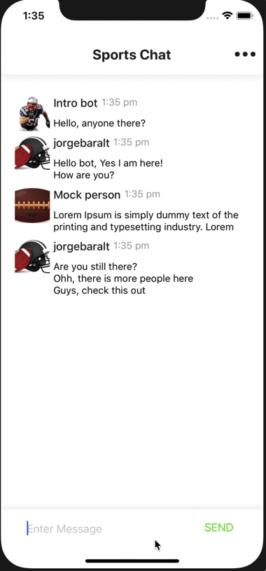

# messaging-demo



## requirements

Expo is the easiest way to start building a new React Native application. It allows you to start a project without installing or configuring any tools to build native code - no Xcode or Android Studio installation required (see Caveats).

Assuming that you have Node 8+ installed, you can use npm to install the Expo CLI command line utility:

```
npm install -g expo-cli
```

## download and run

Install the Expo client app on your iOS or Android phone and connect to the same wireless network as your computer. On Android, use the Expo app to scan the QR code from your terminal to open your project. On iOS, follow on-screen instructions to get a link.

run the following command to clone the project:

```
git clone https://github.com/jorgebaralt/messaging-demo.git
cd messaging-demo
```

go into the project folder and run the following:

```
yarn
yarn start
```

this will open a window in the browser with the QR code to run on a device using Expo app
there is also options on the browser to run on iOS or android simulator

### Running on emulator

https://facebook.github.io/react-native/docs/getting-started

Expo CLI makes it really easy to run your React Native app on a physical device without setting up a development environment. If you want to run your app on the iOS Simulator or an Android Virtual Device, please refer to the instructions for building projects with native code to learn how to install Xcode or set up your Android development environment.

Once you've set these up, you can launch your app on an Android Virtual Device by running npm run android, or on the iOS Simulator by running npm run ios (macOS only).

### ios emulator

I have tested the app only in ios since it is way simpler than android, type the following command in terminal:

```
i
```

this will open the ios emulator and run the app (using a Mac and having Xcode installed)

### android

https://facebook.github.io/react-native/docs/getting-started
